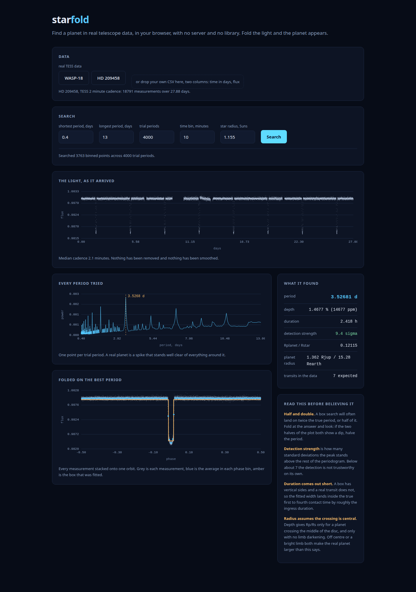

# starfold

Find a planet in real telescope data, in your browser. No server, no library,
no build step. Load a light curve, search every plausible period, fold the
measurements onto the best one, and the transit appears.



## What it does

1. **Loads a light curve.** WASP-18 as observed by TESS ships with it: 18,299
   brightness measurements over 27.4 days, two minute cadence, real data from
   the mission archive. Or drop in your own CSV of time and flux.
2. **Searches for a box.** Box Least Squares (Kovacs, Zucker and Mazeh 2002).
   For every trial period the measurements are folded and binned, then every
   box position and width is scored on how much variance it explains. A transit
   is the only thing in a light curve that is both periodic and box shaped.
3. **Folds and shows you.** The periodogram, the folded curve, the fitted box,
   and the numbers that come out of it.

On the bundled data it recovers **0.94149 days** against the published
**0.94145** for WASP-18 b, a depth of 0.94 per cent, and a planet radius of
1.19 Jupiters against 1.165 published.

## Running it

```
./serve.sh          # then open http://127.0.0.1:8080
```

It needs http rather than a file:// URL, because the search runs in a Web
Worker and the demo data is fetched. Nothing leaves your machine.

## Your own data

A CSV with two columns, time in days and normalised flux. Comment lines
starting with `#` and a header row are both skipped.

```
time,flux
0.000000,1.0001240
0.001389,0.9998733
```

`tools/fetch.py` will build one from any TESS target, using lightkurve:

```
~/AI_Tools/ai_env/bin/python3 tools/fetch.py "HD 209458" data/hd-209458.csv
```

That script is the only part that touches the network, and it is not needed to
use the tool.

## What it is honest about

The tool says all of this on its own face, because a number without its caveat
is worse than no number.

- A box search lands on **twice or half** the true period as often as not.
- **Detection strength** below about 7 sigma is not a detection.
- The fitted **duration comes out short**, because a real transit has sloped
  sides and a box does not.
- The **radius assumes a central crossing and no limb darkening**. Both make the
  real planet bigger than the depth alone suggests.

## Speed

The search bins the measurements to ten minutes first. A transit lasts hours, so
this changes nothing about the shape and cuts the work by five: 18,299 points
becomes 3,727, and 4,000 trial periods take about three seconds instead of
seventeen. Set the bin to 0 to search every point.

## Layout

| file | what it is |
|---|---|
| `index.html` | the whole interface, the plotting, and the wiring |
| `bls.js` | the period search, in a worker so the page stays alive |
| `tools/fetch.py` | builds a CSV from the TESS archive, the only networked part |
| `data/` | real light curves |
